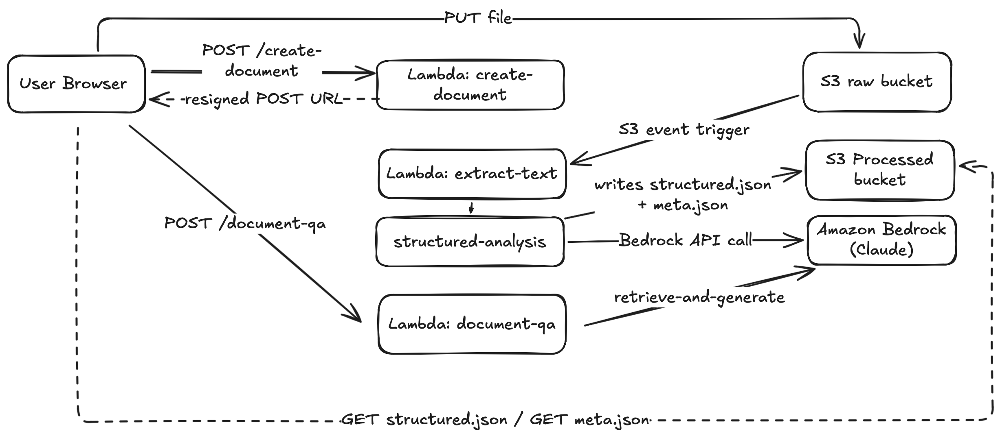

# Civiclens
CivicLens is a personal project originating from the AWS 10,000 IDEAS competition, in which I am currently competing (current phase: Semifinal). CivicLens is a civic AI designed to provide users with a detailed and easy-to-understand analysis of government documents. This repository contains only the backend Lambda logic. The entire project is built on AWS Free Tier.

## Overview

CivicLens processes government documents through a **4-stage AWS powered pipeline**:

1. **create-document** — Authenticates the user and generates a pre-signed S3 URL for PDF upload
2. **extract-text** — Extracts text from the uploaded PDF using PyMuPDF, with AWS Textract as fallback for scanned documents
3. **structured-analysis** — Sends the extracted text to AWS Bedrock (Im using Anthropic Claude Opus 4.5) and returns a structured JSON analysis
4. **document-qa** — Allows users to ask follow-up questions about the document, answered with citations from the source text

## Architecture



For know i have online made my AWS Backend functions pupblic, im not really a frontend guy and currently not sure about all matters of security. Maybe there is going to be a minimal frontend application to cone for my github. 


## Lambda Functions

### create-document
Handles user authentication via JWT and initializes the document upload. Generates a pre-signed S3 POST URL for the PDF upload and creates an initial `meta.json` to track the document status throughout the pipeline.

- **Input:** language, summary level preference
- **Output:** Pre-signed S3 URL, JWT token
- **Status transition:** `→ UPLOADING`

| Variable | Description | Required |
|----------|-------------|----------|
| `JWT_SECRET` | Secret for signing JWT tokens | Yes |
| `RAW_BUCKET` | S3 bucket for PDF uploads | Yes |
| `PROCESSED_BUCKET` | S3 bucket for processed files | Yes |
| `ALLOWED_ORIGIN` | CORS allowed origin | Yes |
| `DEMO_PASSWORD` | Password for demo authentication | No |
| `PRESIGNED_URL_EXPIRATION` | URL expiry in seconds (default: 300) | No |

---

### extract-text
Extracts raw text from the uploaded PDF using a hybrid approach. Tries PyMuPDF first for speed, falls back to AWS Textract for scanned/image-based documents. Validates text quality before saving.

- **Input:** S3 trigger on PDF upload
- **Output:** `extract.txt` in S3
- **Status transition:** `UPLOADING → EXTRACTING → EXTRACTED`

| Variable | Description | Required |
|----------|-------------|----------|
| `RAW_BUCKET` | S3 bucket for PDF uploads | Yes |
| `PROCESSED_BUCKET` | S3 bucket for processed files | Yes |
| `AWS_DEFAULT_REGION` | AWS region (default: eu-central-1) | No |

---

### structured-analysis
Sends the extracted text to AWS Bedrock  and enforces a strict JSON output schema. Supports German and English output at three complexity levels (simple, normal, detailed).

- **Input:** `extract.txt` from S3
- **Output:** `structured.json` in S3
- **Status transition:** `EXTRACTED → STRUCTURING → DONE`

| Variable | Description | Required |
|----------|-------------|----------|
| `PROCESSED_BUCKET` | S3 bucket for processed files | Yes |
| `BEDROCK_MODEL_ID` | Claude model ID for Bedrock | Yes |
| `AWS_DEFAULT_REGION` | AWS region (default: eu-central-1) | No |

---

### document-qa
Allows users to ask follow-up questions about an analyzed document. Answers are grounded in the source text and include exact citations with confidence levels.

- **Input:** `docId` + question + optional language
- **Output:** Answer with citations and confidence level (`high / medium / low`)
- **Status transition:** `DONE → QA_PROCESSING → DONE`

| Variable | Description | Required |
|----------|-------------|----------|
| `JWT_SECRET` | Secret for validating JWT tokens | Yes |
| `PROCESSED_BUCKET` | S3 bucket for processed files | Yes |
| `BEDROCK_MODEL_ID` | Claude model ID for Bedrock | Yes |
| `ALLOWED_ORIGIN` | CORS allowed origin | Yes |
| `AWS_DEFAULT_REGION` | AWS region (default: eu-central-1) | No |

## Deployment 

Using ```deploy.sh``` skript all lambdas can be comressed to ZIP-files including the shared dir in the correct way and the coresponding phython libarys and can then be uploaded and importet into the AWS Lambda function.
